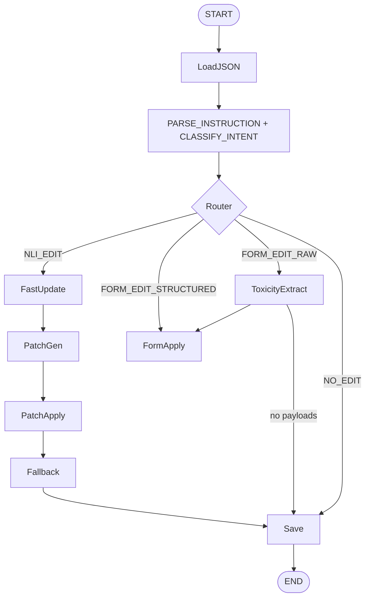

# Toxicity Agent - Technical Architecture

> Detailed technical documentation for developers and architects

## Version History
- **v4.0.0** - Unified edit workflow, single endpoint design
- **v3.0.0** - Batch editing system
- **v2.0.0** - Modular pipeline
- **v1.0.0** - Initial release

---

## Core Architecture

### System Design Philosophy

#### System Purpose
Toxicity Agent unifies natural language editing, structured JSON updates, batch operations, and raw-text extraction into one LangGraph workflow to:

- Update toxicology data across ingredients
- Extract NOAEL/DAP from correction forms
- Apply structured edits safely (with JSON Patch + validation)
- Generate consistent, versioned toxicology profiles
- Perform batch updates across multiple ingredients

#### High-Level System Flow
```bash
FastAPI API
    ↓
LangGraph Unified Edit DAG
    ↓
State Tracking + Version Control  
    ↓
Database (toxicity_data.db)
    ↓
Gradio UI (optional)
```

### Unified Edit Graph (v4.0.0)

#### Core Feature: Single Endpoint for All Edit Types
A single `/api/edit` endpoint supports all edit types through intelligent routing:
| Edit Type               | Trigger                           | Path                                  |
| ----------------------- | --------------------------------- | ------------------------------------- |
| **NLI Edit**            | Natural language instructions     | Fast Update → Patch Gen → Patch Apply |
| **Structured Edit**     | Direct JSON / NOAEL / DAP payload | Form Apply                            |
| **Raw Text Extraction** | Pasted correction forms           | Extraction → Form Apply               |
| **No Edit**             | No valid instructions             | Save only                             |

#### Multi-Agent Routing (LangGraph Classifier)
A classifier routes user instructions to the correct editing agent:

```nginx
Classifier → {NLI Agent | Form Agent | Extraction Agent | No-Op} → Save
```
This ensures:
- Zero-LLM paths for structured edits (100% accuracy)
- LLM-powered patch generation only when needed
- Automatic fallback to full JSON rewrite when patching fails
- Conditional routing based on input content analysis

#### Detailed DAG (v4.0.0)


### JSON Patch Engine
#### Core Mechanism
The system uses RFC 6902 JSON Patch operations for safe, incremental updates:

```bash
# Patch Operation Schema Example 
class PatchOperation(BaseModel):
    op: Literal["add", "remove", "replace", "move", "copy", "test"]
    path: str  # e.g., "/NOAEL/0/value"
    value: Optional[Any] = None
    from_path: Optional[str] = None
```

#### Patch Generation Example
```python
# Input: "Set NOAEL to 200 mg/kg bw/day"
# Output Patch Operations:
[
    {
        "op": "add", 
        "path": "/NOAEL", 
        "value": [{
            "value": 200,
            "unit": "mg/kg bw/day",
            "source": "extracted_from_instruction",
            "type": "NOAEL"
        }]
    },
    {
        "op": "test", 
        "path": "/inci", 
        "value": "L-MENTHOL"  # Safety verification
    }
]
```
Key Benefit: Schema-safe toxicology updates, unlike naive string replacement.

#### Safety Features
1. LLM-generated JSON Patch ops - Transform natural language to structured operations
2. Validation via custom PatchOperation schema - Schema enforcement before application
3. Safe apply with fallback recovery - Automatic rollback on failure
4. Multi-step patch flows - Complex ingredient updates handled incrementally

#### Current Implementation
- [app/graph/utils/schema_tools.py](app/graph/utils/schema_tools.py) - JSON PATCH MODEL
- [app/graph/utils/patch_utils.py](app/graph/utils/patch_utils.py) - `def _generate_patch_with_llm`, `def _apply_patch_safely`

### Toxicology Form Extraction
#### Raw Text -> Structured Data Pipeline
- Paste a correction form → system extracts:
    - NOAEL
    - DAP
    - Study details (species, duration, route)
    - References (source, title, links)
    - Statements (expert judgments, conclusions)

#### Extraction Components
- [app/api/routes_generate.py](app/api/routes_generate.py) - GeneratedPayloadResponse (payload)
- [app/graph/utils/toxicity_utils.py](app/graph/utils/toxicity_utils.py) - build_noael_payload, build_dap_payload (payload builders)
- [app/graph/nodes/toxicity_extract.py](app/graph/nodes/toxicity_extract.py) - toxicity_extract_node (node to extract toxicity data)

#### Direct Payload Application
- Extracted data is directly applied as structured payloads without extra HTTP hops, maintaining:
    - Data lineage (source → extraction → application)
    - Audit trail (who extracted what and when)
    - Version control (each edit creates new version)

### Batch Editing System (v3.0.0+)
#### Designed for Regulatory Workloads
- Handles real-world PIF corrections across multiple ingredients:
```python
# Batch Request Structure
{
    "requests": [
        {
            "inci_name": "L-MENTHOL",
            "instruction": "Set NOAEL to 200 mg/kg bw/day",
            "conversation_id": "thread-123"  # Shared per INCI
        },
        {
            "inci_name": "SALICYLIC_ACID", 
            "instruction": "Update DAP to 3%",
            "conversation_id": "thread-456"
        }
    ]
}
```
#### Batch Processing Features
- `POST /api/edit/batch` - Submit multiple edits
- Shared thread_id per INCI - Enables incremental edits
- Unique `batch_id` for grouping - Track related updates
- Query endpoints for inspection - Monitor batch progress
- Isolation guarantees - One INCI's failure doesn't affect others

#### Query Endpoints
```bash
GET  /api/edit/batch/{batch_id}      # Get batch status and results
GET  /api/edit/inci/{inci_name}      # Get ingredient edit history
```

### Database Schema
#### Current Implementation 
- [core/database.py](core/database.py) - ToxicityVersion, ToxicityDB, ToxicityRepository (Toxicity Data Database)
- [docs/database_usage_guide.md](docs/database_usage_guide.md) - Chat Memory Database, Toxicity Data Database

#### Primary Database: `toxicity_data.db`
- checkpoints (managed by LangGraph)
    ```sql
    -- Checkpoints table (managed by LangGraph)
    CREATE TABLE checkpoints (
        thread_id TEXT NOT NULL,
        checkpoint_ns TEXT NOT NULL DEFAULT '',
        checkpoint_id TEXT NOT NULL,
        parent_checkpoint_id TEXT,
        type TEXT,
        checkpoint BLOB,
        metadata BLOB,
        PRIMARY KEY (thread_id, checkpoint_ns, checkpoint_id)
    );

    -- Writes table (for checkpoint metadata)
    CREATE TABLE writes (
        thread_id TEXT NOT NULL,
        checkpoint_ns TEXT NOT NULL DEFAULT '',
        checkpoint_id TEXT NOT NULL,
        task_id TEXT NOT NULL,
        idx INTEGER NOT NULL,
        channel TEXT NOT NULL,
        type TEXT,
        value BLOB,
        PRIMARY KEY (thread_id, checkpoint_ns, checkpoint_id, task_id, idx)
    );
    ```

#### Supporting Database: `chat_memory.db`
- toxicity_versions
    ```python
    class ToxicityVersion(Base):
        """Store each version of toxicity JSON"""
        __tablename__ = "toxicity_versions"
        
        id = Column(Integer, primary_key=True)
        conversation_id = Column(String(100), index=True) # item_id / thread_id
        batch_id = batch_id = Column(String(100), index=True, nullable=True)  # for batch record 
        inci_name_track = Column(String(255), nullable=True) # <<< NEW FIELD: INCI being edited
        version = Column(Integer)
        data = Column(Text)  # JSON string
        modification_summary = Column(Text)
        # created_at = Column(DateTime, default=datetime.utcnow) # deprecated 
        created_at = Column(DateTime, default=lambda: datetime.now(timezone.utc))
        patch_operations = Column(Text, nullable=True) # Add patch operation
        is_batch_item = Column(Boolean, default=False) # <<< NEW FIELD: Optional flag to indicate a batch item
    ```

#### Data Flow Integration
- Graph writes back the final JSON after each agent step, maintaining consistency between LangGraph state and database.
    ```bash
    LangGraph Node → Database Writer → 
        ├── Write to toxicity_records (new version)
        ├── Update conversation_memory (thread state)
        ├── Link via conversation_id (traceability)
        └── Commit (atomic operation)
    ```

### API Specifications
[Detailed endpoint specifications, request/response schemas]
#### Unified Edit Endpoint
```bash
POST /api/edit
Content-Type: application/json

{
    "instruction": "string",           # Natural language or raw text
    "inci_name": "string",             # Required for all edits
    "conversation_id": "string",       # Optional: for continuing conversations
    "structured_payload": {            # Optional: direct JSON payload
        "NOAEL": [...],
        "DAP": [...]
    }
}

Response (200 OK):
{
    "inci": "L-MENTHOL",
    "updated_json": { ... },           # Full updated toxicology JSON
    "edit_type": "NLI_EDIT",           # NLI_EDIT | FORM_EDIT_RAW | FORM_EDIT_STRUCTURED
    "batch_id": "batch_abc123",        # If part of batch
    "version": 5,
    "patch_operations": [...],         # Applied patch operations
    "raw_response": "Success message"
}
```
#### Batch Edit Endpoint
```bash
POST /api/edit/batch
Content-Type: application/json

{
    "requests": [
        {
            "instruction": "Set NOAEL to 200 mg/kg",
            "inci_name": "L-MENTHOL"
        },
        {
            "instruction": "Update DAP to 5%",
            "inci_name": "SALICYLIC_ACID"
        }
    ]
}

Response (202 Accepted):
{
    "batch_id": "batch_xyz789",
    "status": "processing",
    "items": [
        {"item_id": 1, "inci": "L-MENTHOL", "status": "queued"},
        {"item_id": 2, "inci": "SALICYLIC_ACID", "status": "queued"}
    ],
    "estimated_completion": "2024-01-15T10:30:00Z"
}
```
#### 

---

## Development Guide

### Adding New Toxicology Fields
Define schema in `app/graph/utils/toxicity_schemas.py` following existing patterns like `NOAELUpdateSchema`. Register the field in `TOXICOLOGY_FIELDS` in `app/config.py` and update the `JSON_TEMPLATE` mapping. Add extraction logic in `app/graph/utils/toxicity_utils.py` using functions like `build_{field}_payload()`. Update the template JSON file (path set via `JSON_TEMPLATE_PATH` in config) and write corresponding tests in `tests/`. These changes integrate automatically with the unified edit workflow.

### Extending the Workflow
Create a node in `app/graph/nodes/` that implements `async def node_function(state):`. Register it in `build_graph.py` using `graph.add_node()`. Add routing logic with `add_conditional_edges()` to activate based on specific conditions. Connect the node to existing nodes like `save` or `classify`. Each node receives and returns the `JSONEditState` dictionary.

---

## Roadmap 
- v4.0.0 — Unified graph
- v3.0.0 — Batch editing
- v2.0.0 — Modular multi-node pipeline
- v5.0.0 (Planned)
    - Fine-tuned small model for NOAEL/DAP extraction (LoRA)
    - RAG-based ingredient knowledge retrieval
    - More domain schemas: impurities, sensitization, systemic toxicity
    - Versioned toxicology datasets (per formula, per ingredient)