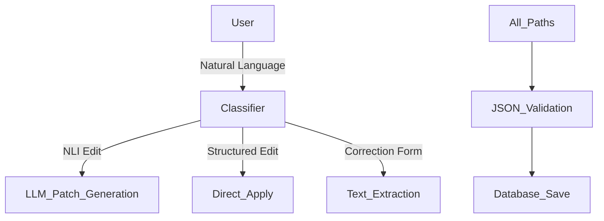

# Toxicity Agent

> LangGraph-powered agent for managing cosmetic ingredient toxicology data using natural language instructions.

## 🎯 Overview

FastAPI service that transforms natural language into structured toxicology JSON updates using LLMs (GPT-4o-mini or Llama3.1:8b). **Now featuring unified edit workflow (v4.0.0), batch operations, and raw-text extraction.**

**Key Features:**
- Natural language to JSON transformation (NLI edits)
- **Unified edit workflow** - single endpoint for all edit types
- **Batch editing** for multiple ingredients
- **Raw text extraction** from correction forms
- Multi-model support (OpenAI / Ollama)
- Automatic validation and normalization
- Supports NOAEL, DAP, acute toxicity, and more
- Anti-cheating safeguards
- **JSON Patch engine** for safe structured editing

---

## 🏗️ Architecture Quick View

> For detailed technical architecture, see [ARCHITECTURE.md](ARCHITECTURE.md)

The system uses a **LangGraph workflow** that routes edits intelligently:



Core Components:
- FastAPI - REST interface
- LangGraph - Workflow orchestration
- SQLite - Data persistence
- Gradio - Optional web UI

---

## 📁 Folder Structure

```
toxicity-agent/
├── app/                              # Main application
│   ├── config.py                     # Configuration
│   ├── main.py                       # FastAPI app
│   ├── api/routes_edit.py            # API endpoints
│   ├── graph/                        # LangGraph workflow
│   │   ├── state.py                  # State definitions
│   │   ├── build_graph.py            # Graph compilation
│   │   └── nodes/llm_edit_node.py    # LLM processing (⚙️ MODEL CONFIG)
│   └── services/                     # Business logic
│       ├── json_io.py                # File I/O
│       ├── text_processing.py        # Text extraction
│       └── data_updater.py           # Data merging
├── data/                             # JSON files
│   ├── toxicity_data_template.json   # Active file
│   └── test_results/                 # Test outputs
├── tests/                            # Test suite
│   ├── test_l_menthol.py             # Comprehensive tests
│   └── test_l_menthol_workflow.sh    # Test automation
├── docs/                             # Documentation
└── run.py                            # Entrypoint
```

---

## 🚀 Quick Start

### Installation
```bash
# Create virtual environment
/opt/homebrew/bin/python3.13 -m venv venv
source venv/bin/activate

# Install dependencies
pip install -r requirements.txt
# Or use: make install

# Configure model (choose one):
# Option A: GPT-4o-mini (recommended for testing)
echo "OPENAI_API_KEY=your_key" > .env

# Option B: Llama3.1:8b (free, local)
ollama serve && ollama pull llama3.1:8b
```

### Run Tests
```bash
python -m pytest tests/ -v
# Or use: make test
```

### Start Server
```bash
python3 run.py
# Or use: make run

# API Docs: http://localhost:8000/docs
```

### Using Make Commands (Optional)

If you have `make` installed, you can use these shortcuts:
```bash
make install     # Install dependencies
make test        # Run all tests
make run         # Start server
make clean       # Clean temporary files
make help        # Show all commands
```

### Model Configuration

Edit `app/graph/nodes/llm_edit_node.py`:

```python
# GPT-4o-mini (Recommended - 95% consistency)
from langchain_openai import ChatOpenAI
llm = ChatOpenAI(model="gpt-4o-mini", temperature=0)

# Llama3.1:8b (Free - 60% consistency, needs validation)
from langchain_ollama import ChatOllama
llm = ChatOllama(model="llama3.1:8b")
```

---

## 📡 API Endpoints

| Endpoint | Method | Description |
|----------|--------|-------------|
| `/api/current` | GET | Get current JSON data |
| `/api/reset` | POST | Reset to template |
| `/api/edit` | POST | Edit with natural language |
| `/health` | GET | Health check |

---

## 💡 Usage Example

### Request

```bash
curl -X POST http://localhost:8000/api/edit \
  -H "Content-Type: application/json" \
  -d '{
    "instruction": "Set NOAEL to 200 mg/kg bw/day, Source: OECD SIDS MENTHOLS UNEP PUBLICATIONS, Reference: https://hpvchemicals.oecd.org/ui/handler.axd?id=463ce644-e5c8-42e8-962d-3a917f32ab90",
    "inci_name": "L-MENTHOL"
  }'
```

### Response

```json
{
  "inci": "L-MENTHOL",
  "updated_json": {
    "inci": "L-MENTHOL",
    "NOAEL": [
      {
        "note": null,
        "unit": "mg/kg bw/day",
        "experiment_target": null,
        "source": "oecd",
        "type": "NOAEL",
        "study_duration": null,
        "value": 200
      }
    ],
    "repeated_dose_toxicity": [
      {
        "reference": {
          "title": "OECD SIDS MENTHOLS",
          "link": "https://hpvchemicals.oecd.org/ui/handler.axd?id=..."
        },
        "data": ["NOAEL of 200 mg/kg bw/day established..."],
        "source": "oecd",
        "statement": "Based on OECD SIDS MENTHOLS publication",
        "replaced": {"replaced_inci": "", "replaced_type": ""}
      }
    ],
    "DAP": [],
    "percutaneous_absorption": []
  },
  "raw_response": "✅ Successfully updated ['inci', 'NOAEL', 'repeated_dose_toxicity'] for L-MENTHOL"
}
```

---

## 🔄 Unified Edit System (v4.0.0)

The `/api/edit` endpoint now handles all edit types:

| Edit Type | Trigger | Example |
|-----------|---------|---------|
| **Natural Language** | "Set NOAEL to 200 mg/kg" | Standard instruction |
| **Structured Edit** | Direct JSON payload | `{"NOAEL": [{"value": 200, ...}]}` |
| **Correction Form** | Pasted text from forms | Raw text extraction to structured data |

See [ARCHITECTURE.md](ARCHITECTURE.md) for technical details.

---

## 🎯 Supported Update Types

| Type | Example Instruction |
|------|---------------------|
| **NOAEL** | `"Set NOAEL to 200 mg/kg bw/day from OECD"` |
| **DAP** | `"Set DAP to 5% based on expert judgment"` |
| **Acute Toxicity** | `"Add acute toxicity study from FDA showing LD50 of 500 mg/kg"` |
| **Skin Irritation** | `"Add skin irritation study showing no irritation"` |

---

## 📊 Database Integration

The system now persists data to SQLite:
- `toxicity_data.db` - Main toxicology data
- `chat_memory.db` - Conversation history
- Supports batch operations with `batch_id` tracking

Query endpoints:
```bash
GET /api/edit/batch/{batch_id}      # Get batch status
GET /api/edit/inci/{inci_name}      # Get ingredient history
```

---

## 🧪 Testing

### Quick Test

```bash
# Start server
python3 run.py

# Run test (in another terminal)
python3 tests/test_l_menthol.py
```

### Robustness Testing

```bash
# Test 5 times for consistency
./tests/test_l_menthol_workflow.sh

# Run multiple times
for i in {1..5}; do ./tests/test_l_menthol_workflow.sh; sleep 2; done

# Results saved to: data/test_results/
```

### Anti-Cheating Verification

```bash
# Check if model copied example data (should find nothing)
grep '"experiment_target": "Rats"' ./data/test_results/*/*.json
grep '"study_duration": "90-day"' ./data/test_results/*/*.json
grep '"value": 800' ./data/test_results/*/*.json
# Expected: No matches = ✅ No cheating
```

---

## 🛠️ Development

### Architecture

```
User Request → FastAPI → LangGraph → LLM Node → Data Updater → JSON I/O
```

### Adding New Toxicology Field

1. **Update `app/config.py`**:
   ```python
   TOXICOLOGY_FIELDS = ["acute_toxicity", ..., "your_new_field"]
   ```

2. **Update prompt in `app/graph/nodes/llm_edit_node.py`**

3. **Add to template in `data/toxicity_data_template.json`**:
   ```json
   {"your_new_field": []}
   ```

4. **Add tests in `tests/`**

---

## 📊 Tested Scenarios

### 1. Create & Update
```bash
curl http://localhost:8000/api/current
curl -X POST http://localhost:8000/api/edit -d '{"instruction": "...", "inci_name": "L-MENTHOL"}'
curl http://localhost:8000/api/current
```

### 2. Reset & Restart
```bash
curl -X POST http://localhost:8000/api/reset
curl http://localhost:8000/api/current
```

### 3. Multiple Edits
```bash
curl -X POST http://localhost:8000/api/edit -d '{"instruction": "Set NOAEL to 200", "inci_name": "L-MENTHOL"}'
curl -X POST http://localhost:8000/api/edit -d '{"instruction": "Set DAP to 5%", "inci_name": "L-MENTHOL"}'
```

---

## 🐛 Troubleshooting

**Server won't start:**
```bash
lsof -i :8000          # Check port
kill -9 <PID>          # Kill process
python3 run.py         # Restart
```

**Ollama not working:**
```bash
curl http://localhost:11434/api/tags
ollama serve
ollama pull llama3.1:8b
```

**Tests failing:**
```bash
curl http://localhost:8000/health  # Check server
python3 tests/test_l_menthol.py -v # Verbose output
tail -f logs/toxicity_agent.log    # Check logs
```

---

## 📈 Model Comparison

| Metric | GPT-4o-mini | Llama3.1:8b |
|--------|-------------|-------------|
| Consistency | ✅ 95% | ⚠️ 60% |
| Anti-Cheating | ✅ Perfect | ✅ Perfect |
| Production Ready | ✅ Yes | ⚠️ Needs validation |
| Cost | Paid | Free |

**Recommendation:** Use GPT-4o-mini for production (consistent & reliable).

---

## 📚 Documentation

- [docs/refactoring_guide.md](docs/refactoring_guide.md) - Refactoring guide
- [docs/comprehensive_model_evaluation.md](docs/comprehensive_model_evaluation.md) - Model comparison
- [docs/toxicity_agent_review.md](docs/toxicity_agent_review.md) - Architecture review

---

## 🔧 Key Concepts

**LangGraph Workflow:** State machine that processes requests through parse → LLM → validate → merge → save stages.

**Anti-Cheating:** Uses placeholder-based examples (`{{EXTRACT_FROM_INSTRUCTION}}`) to prevent LLMs from copying specific values.

**Data Normalization:** Automatically converts sources to lowercase, sets unspecified fields to `null`, and fixes common LLM errors.

---

## 🚦 Production Checklist

- [ ] Set `OPENAI_API_KEY` environment variable
- [ ] Use GPT-4o-mini for consistency
- [ ] Add authentication middleware
- [ ] Configure CORS for frontend
- [ ] Set up monitoring/logging
- [ ] Implement rate limiting
- [ ] Add database persistence

---

## 📝 License

MIT License

Copyright (c) 2025 Sandy Teng

Permission is hereby granted, free of charge, to any person obtaining a copy
of this software and associated documentation files (the "Software"), to deal
in the Software without restriction, including without limitation the rights
to use, copy, modify, merge, publish, distribute, sublicense, and/or sell
copies of the Software, and to permit persons to whom the Software is
furnished to do so, subject to the following conditions:

The above copyright notice and this permission notice shall be included in all
copies or substantial portions of the Software.

THE SOFTWARE IS PROVIDED "AS IS", WITHOUT WARRANTY OF ANY KIND, EXPRESS OR
IMPLIED, INCLUDING BUT NOT LIMITED TO THE WARRANTIES OF MERCHANTABILITY,
FITNESS FOR A PARTICULAR PURPOSE AND NONINFRINGEMENT. IN NO EVENT SHALL THE
AUTHORS OR COPYRIGHT HOLDERS BE LIABLE FOR ANY CLAIM, DAMAGES OR OTHER
LIABILITY, WHETHER IN AN ACTION OF CONTRACT, TORT OR OTHERWISE, ARISING FROM,
OUT OF OR IN CONNECTION WITH THE SOFTWARE OR THE USE OR OTHER DEALINGS IN THE
SOFTWARE.

---