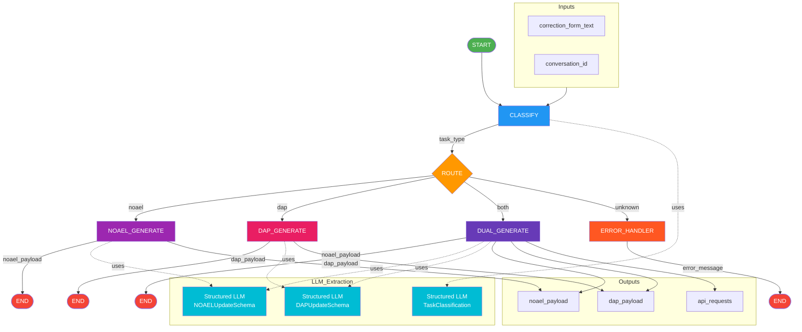

---

## Toxicity Imputation Graph 說明

### 節點說明

| Node | Function | Description |
|------|----------|-------------|
| `CLASSIFY` | `toxicity_classify_node` | 使用 LLM 判斷修正單類型 (NOAEL/DAP/both) |
| `ROUTE` | `route_by_task_type` | 根據分類結果路由到對應節點 |
| `NOAEL_GENERATE` | `noael_generate_node` | 提取 NOAEL 資料並生成 payload |
| `DAP_GENERATE` | `dap_generate_node` | 提取 DAP 資料並生成 payload |
| `DUAL_GENERATE` | `toxicity_dual_generate_node` | 同時提取 NOAEL + DAP |
| `ERROR_HANDLER` | `toxicity_error_node` | 處理無法識別的情況 |

### State 定義

```python
class ToxicityImputationState(TypedDict):
    # Input
    correction_form_text: str
    conversation_id: str
    
    # Classification
    task_type: str  # "noael", "dap", "both", "unknown"
    has_noael_data: bool
    has_dap_data: bool
    current_inci: str
    
    # NOAEL Output
    noael_payload: dict
    noael_json: str
    
    # DAP Output
    dap_payload: dict
    dap_json: str
    
    # API
    api_requests: list
```

### 與 Edit Graph 的差異

| 特性 | Edit Graph | Toxicity Imputation Graph |
|------|------------|---------------------------|
| 用途 | 編輯現有 JSON | 從修正單生成 payload |
| State | `JSONEditState` | `ToxicityImputationState` |
| 輸入 | instruction + json_data | correction_form_text |
| 輸出 | 修改後的 JSON | API payload |
| 資料庫 | 讀寫 toxicity_data.db | 無 (僅生成 payload) |
| Checkpointer | 使用 chat_memory.db | 無 |

### 整合方向

```
修正單 (.docx/.txt)
    │
    ▼
┌─────────────────────┐
│ Toxicity Imputation │  ← 生成 payload
│      Graph          │
└──────────┬──────────┘
           │ noael_payload / dap_payload
           ▼
┌─────────────────────┐
│    Edit Graph       │  ← 更新到資料庫
│ (POST /edit-form)   │
└─────────────────────┘
```
